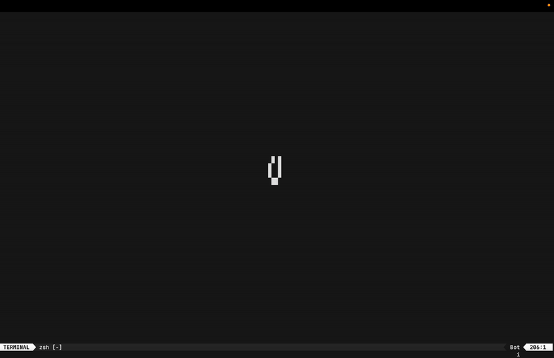

# Game of Life

Command Line
[Game of Life](https://en.wikipedia.org/wiki/Conway%27s_Game_of_Life)
implementation using **Jetpack Compose**.

## Demo



## Code

Rendering **Game of Life** is implemented using a simple Composable function:

```kotlin
@Composable
fun GameOfLifeContent(
  config: MosaicGameOfLife,
  game: GameOfLife,
) {
  val (width, height) = LocalTerminal.current.size

  Column {
    repeat(height) { column ->
      Row {
        repeat(width) { row ->
          val centeredCoordinate = Coordinate(
            x = row - width / 2,
            y = column - height / 2,
          )
          val isAlive = game.isAlive(centeredCoordinate)
          val char = if (isAlive) config.aliveChar else config.deadChar
          Text("$char")
        }
      }
    }
  }
}
```

## Running (zero dependencies required)

First, **clone this repo** and CD into it. Then copy-paste a command depending
on your system:

### Unix

```shell
./gradlew mosaic:installDist &&
./mosaic/build/install/mosaic/bin/mosaic
```

### Windows

```shell
gradlew.bat mosaic:installDist &&
mosaic/build/install/mosaic/bin/mosaic.bat
```

## Mosaic

This showcase uses [Mosaic](https://github.com/JakeWharton/mosaic) library,
which is based on **Jetpack Compose** and can help with creating arbitrary TUI
(Terminal UI) Apps.

